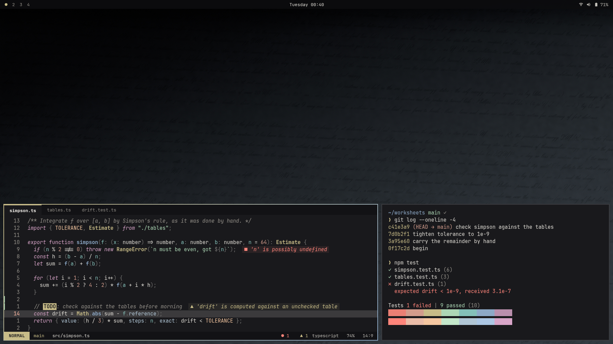
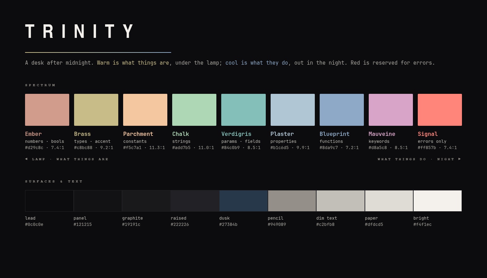

# Trinity



A desk theme for [Omarchy](https://omarchy.org/), built for long technical
work after dark. It imagines the desk J. Robert Oppenheimer might have kept at
Los Alamos in 1943–45: a blackboard, a lamp, graph paper, a pencil, a
cigarette, a window at dusk. It draws on the room where the work was done,
not on anything the work produced. Graphite and low light, one brass lamp,
New Mexico going dark outside, and ink that stays readable at two in the
morning.

## Install

Omarchy menu (`Super + Space`) → **Install → Style → Theme**, paste the git URL
of this repository. Or:

```sh
omarchy theme install https://github.com/philsinatra/omarchy-trinity-theme.git
```

That's all. Like every Omarchy theme, Trinity is one `colors.toml`, and
Omarchy generates Neovim, VS Code, Helix, the terminals, btop, Chromium,
Hyprland and the shell from it.

## Graphite, a lamp, and inks

**The chassis is graphite**, `#19191c`: pencil lead at almost no chroma,
leaning the same faint violet as Adwaita-dark. Omarchy always shows Nautilus,
file pickers and every other GTK/libadwaita window in stock Adwaita-dark, and
no theme can change that. So Trinity's editor background sits within 0.017
OKLab of Nautilus's file pane, and its raised surface is Adwaita's window
grey exactly. The terminal and the file manager read as one material. The
only warm thing in the chrome is the lamp.

**The syntax is inks**: lower chroma than a neon palette, with lightness doing
as much of the work as hue. **Warm is what things are**, under the lamp:
types and literal values. **Cool is what things do** and what they are
called, out in the room and the night: functions, parameters, properties,
strings. Keywords sit apart in mauveine, the aniline violet of copying
pencils and ditto masters. Red is the one signal colour and means an error.

| | Colour | Hex | Carries |
| --- | --- | --- | --- |
| **lamp** | Ember | `#d29c8c` | numbers, booleans |
| | Brass | `#c8bc88` | types, classes — and the theme accent |
| | Parchment | `#f5c7a1` | constants |
| **night** | Chalk | `#add7b5` | strings |
| | Verdigris | `#84c0b9` | parameters, fields |
| | Plaster | `#b1c6d5` | properties |
| | Blueprint | `#8da9c7` | functions |
| **apart** | Mauveine | `#d8a5c8` | keywords — the language itself |
| **signal** | Red | `#ff857b` | errors |
| | Pencil | `#949089` | comments |
| | Paper | `#dfdcd5` | plain variables, body text |

Selection is the window at dusk, `#27384b`. Every colour is picked for the role
Omarchy's templates give its slot, so Neovim and VS Code read the same way with
no editor-specific files.



### Measured, not eyeballed

The palette is generated in OKLCH by `scripts/genpalette.py`, which refuses to
write unless every constraint holds:

| Check | Target | Trinity |
| --- | --- | --- |
| body text on background | ≥ 11:1 | **12.8:1** |
| comments | ≥ 4.8:1 | **5.5:1** |
| every syntax role | ≥ 7:1 | **7.2 – 11.3:1** |
| closest pair of roles (OKLab ΔE) | ≥ 0.07 | **0.071** (parameter / property) |
| chassis chroma | ≤ 0.008 | **0.0065** |
| editor background to Nautilus's view (`#1d1d20`) | ≤ 0.025 ΔE | **0.017** |
| lamp (accent) chroma | ≤ 0.100 | **0.070** |
| every role vs. the same role in Endurance | ≥ 0.050 ΔE (errors ≥ 0.030) | **0.057** (errors 0.038) |
| every colour inside sRGB | yes | yes |

Per role, against the editor background:

| Role | Slot | Hex | Contrast | From Endurance |
| --- | --- | --- | --- | --- |
| keyword | `bright_magenta` | `#d8a5c8` | 8.5:1 | 0.067 |
| type | `yellow` | `#c8bc88` | 9.2:1 | 0.064 |
| constant | `bright_yellow` | `#f5c7a1` | 11.3:1 | 0.062 |
| number | `orange` | `#d29c8c` | 7.4:1 | 0.058 |
| string | `green` | `#add7b5` | 11.0:1 | 0.060 |
| parameter | `cyan` | `#84c0b9` | 8.5:1 | 0.057 |
| property | `bright_cyan` | `#b1c6d5` | 9.9:1 | 0.057 |
| function | `blue` | `#8da9c7` | 7.2:1 | 0.061 |
| error | `bright_red` | `#ff857b` | 7.4:1 | 0.038 |
| comment | `muted` | `#949089` | 5.5:1 | — |
| variable | `foreground` | `#dfdcd5` | 12.8:1 | — |

The distance check is the one that matters in a dense buffer. The eleven
roles a reader has to tell apart in Neovim are keyword, type, constant,
number, string, parameter, property, function, error, comment and plain
variable, and no two of them may sit closer than 0.07 in OKLab. The Endurance
check exists because the two themes share Omarchy's templates and the same
warm/cool structure. Without it, the generator drifts back toward Endurance's
answers; with it, every role is at least two just-noticeable steps away.

## Backgrounds

Three views from the window, and the lamp.

| File | Subject | Size | Mean |
| --- | --- | --- | --- |
| `1-sangre-de-cristo.jpg` | A full moon over the Sangre de Cristo crest at blue hour — Mike Lewinski, CC BY 2.0 | 5120×2880 | 10% |
| `2-lamplight.webp` | The theme gradient: tungsten from off-frame left, night to the right, nothing else | 3840×2160 | 10% |
| `3-gloaming.jpg` | White Sands a few minutes after sunset — Charles & Maggie Boyer, CC BY 2.0 | 3840×2160 | 12% |
| `4-cabezon.jpg` | Cabezon Peak under a dusk sky — Bob Wick, BLM, public domain | 5120×2880 | 11% |

Every frame keeps its top edge dark (top 8% under 5% mean luminance), so the
status bar always has contrast. Nothing is upscaled. The photographs are
cropped and darkened by `scripts/grade.py`. Credits, licences and the full
list of changes are in [`backgrounds/CREDITS.md`](backgrounds/CREDITS.md).
Cycle them with `omarchy theme bg next`.

## Unlock screen

The boot and disk-unlock wordmark is set as a drawing title block, with a line
of Oppenheimer's in the footer:

> There must be no barriers to freedom of inquiry.
> — J. Robert Oppenheimer, quoted in *Life*, October 1949

## What is shipped

| File | Purpose |
| --- | --- |
| `colors.toml` | The theme. Omarchy generates every app's config from it |
| `btop.theme` | Omarchy's btop template with red kept for alarms only (generated) |
| `icons.theme` | `Yaru-yellow-dark` — dark icons, lamp-coloured folders |
| `keyboard.rgb` | Brass, and nothing else, for RGB keyboards |
| `backgrounds/` | Four frames — see [`backgrounds/CREDITS.md`](backgrounds/CREDITS.md) |
| `preview.webp`, `docs-palette.webp` | Theme picker thumbnail, palette card |
| `unlock.png`, `preview-unlock.png` | Boot / disk-unlock (Plymouth) title block and its preview |
| `scripts/genpalette.py` | OKLCH constants → `colors.toml` and `btop.theme`, with every check above |
| `scripts/oklch.py` | OKLCH ↔ sRGB, WCAG contrast, OKLab distance; no dependencies (shared with Endurance) |
| `scripts/check.py` | Palette, background luminance and git-install checks in one run |
| `scripts/gradient.py` | Renders `2-lamplight.webp` |
| `scripts/grade.py` | Crops and grades the three photographs; its table is the list of changes |
| `scripts/photo.py` | Shared fetch, colour and grain helpers |
| `scripts/cards.py` | Renders the unlock title block, palette card and preview from `colors.toml` (Chromium) |

The background and card scripts need numpy and Pillow; the original
photographs are fetched once into `scripts/.cache/`, which git ignores.
`genpalette.py`, `oklch.py` and the palette part of `check.py` need only
Python.

## Design rules

1. Colour is information. Each hue has one job, and you can learn them all in
   a minute.
2. Warm is what things are, cool is what they do. Red is kept for errors; the
   terminal and btop never use it for decoration.
3. Harmony is enforced numerically: contrast floors for text, comments and
   every syntax role, a minimum perceptual distance between roles, chroma
   ceilings for the chassis and the lamp, and a generator that refuses to
   write a palette that breaks any of it.
4. The chassis matches the desktop it lives in. Graphite at near-zero chroma,
   measured against the Adwaita-dark that Nautilus and every GTK dialog
   always use.
5. One lamp. The accent is a single brass colour, used for focus, the cursor,
   types and the keyboard, and nowhere decoratively.
6. A sibling, not a copy. Every syntax role keeps a measured distance from
   Endurance's.
7. One file installs everything. No editor-specific code, nothing Omarchy has
   to drop from a git install.
8. The room, not the event. No clouds, bombs, trefoils, orbits, equations on
   the wall, insignia or flags. Backgrounds are real places, single-subject,
   never upscaled, dark at the top edge, and quiet enough to work in front of.

## License

Theme files and the gradient are MIT — see [`LICENSE`](LICENSE). The White
Sands and Sangre de Cristo photographs are CC BY 2.0 (Charles & Maggie Boyer;
Mike Lewinski), modified as listed in
[`backgrounds/CREDITS.md`](backgrounds/CREDITS.md). The Cabezon Peak
photograph (Bob Wick, BLM) is in the public domain.

Trinity is not affiliated with or endorsed by the estate of J. Robert
Oppenheimer, Los Alamos National Laboratory, the U.S. Department of Energy,
the Bureau of Land Management, the National Park Service, or any of the
photographers.
